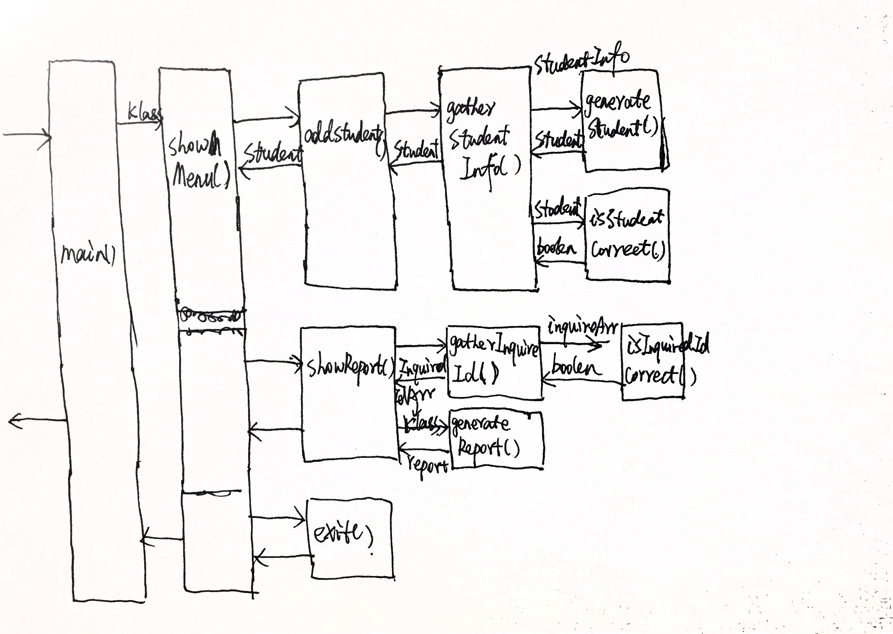

## Tasking 图



## 思路

### Student 类

根据学生姓名和ID来创建Student类，该类可以设置成绩，成绩以对象形式保存，key为科目名称，value为成绩分数。Student类还有获取学生总分和平均分的方法。

### Class 类

该类可用来存储学生，有addStudent()方法来增加学生，有getStudentById()方法来根据id获取到相应的学生。同时也可以获取班级同学总分，同学总分及平均数。

### 主要思路

main()函数中会不断的调用showMenu()函数来展示选择菜单来供用户进行选择。根据用户输入的不同，主要可以分为三个功能模块：

1. 添加学生
2. 打印学生成绩单
3. 退出

#### 添加学生

addStudent()函数会调用gatherStudentInfo()来获取控制台的输入并生成一个student实例，再根据isStudentCorrect()函数来判断该实例是否合乎规范，不规范的话会提示重新输入。最后返回一个Student实例，该实例会被添加到一个Class的实例中。

#### 打印学生成绩单

gatherInquireId()函数会收集用户在控制台的输入，并根据isInquireIdCorrect()来判断输入是否正确，然后generateReport
()函数来生成报告。最后返回报告。

#### 退出

退出前会进行确认，确认后会以退出进程的方式来退出。

## 测试方法

首先初次下载完需要安装依赖：

```
  npm install
```

然后才能执行测试：

```
  npm test
```

单个文件测试：

```
  npm run test-single spec/*.js
```
